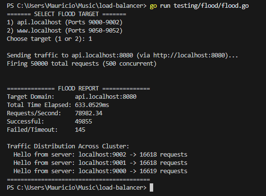
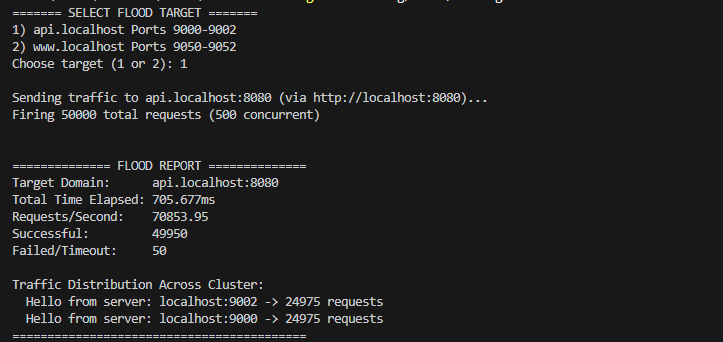
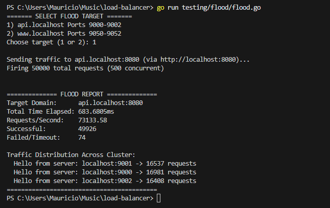
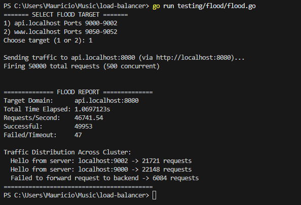
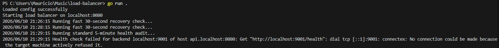
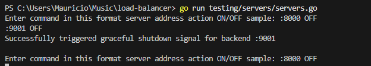

# Custom High-Concurrency Layer 7 Load Balancer
 
A highly concurrent Layer 7 reverse proxy and load balancer written in Go. Built as a personal project to learn systems programming and Go concurrency patterns. It ingests microservice cluster layouts via JSON configuration, manages traffic spikes using an event-driven adaptive deadline queue, and routes traffic through custom-tuned connection pools using thread-safe load balancing algorithms.
 
---
 
## 🚀 Key Features
 
- **Host-Based Environment Routing** — Routes incoming traffic to isolated backend clusters based on the request's `Host` header (e.g., `api.localhost:8080` vs `www.localhost:8080`), enabling true multi-environment routing without path rewriting.
- **Non-Blocking Channel Gatekeeper** — Implements a strict capacity boundary via weightless `struct{}{}` buffered channels rather than heavy worker pools, keeping CPU usage low.
- **Timed Backoff Waiting Room** — Replaces instant traffic rejections with a thread-safe `time.After` channel race, giving burst traffic a 25ms window to acquire a slot before returning a 503.
- **Adaptive Request Deadlines** — Sets read deadlines dynamically based on `Content-Length`, giving large payloads proportionally more time while keeping a hard 5s cap on requests with unknown body sizes — mitigating slowloris-style attacks.
- **Context Pass-Through Protection** — Utilizes `http.NewRequestWithContext` to link client sockets directly to backend pipes, tearing down upstream connections instantly if a user disconnects.
- **Lock-Free Backend Snapshots** — Stores backend lists and per-backend connection counters in `atomic.Value`, allowing goroutines to read routing state without mutexes or blocking.
- **Dynamic Connection Pool Sizing** — Computes `MaxIdleConns` at startup as `(numberOfBackends × max_idle_conns) + numberOfBackends`, ensuring each backend gets a dedicated idle connection budget without starving others.
- **Zero-Copy Byte Mirroring** — Streams data payloads via raw `[]byte` memory blocks, transparently reflecting backend status codes and headers with minimal allocation overhead.
---
 
## 📊 Benchmarks
 
Tested on an AMD Ryzen 9 9800X3D using a custom Go flood tool firing 50,000 requests at 500 concurrent goroutines with a shared persistent HTTP client.
 
### Round Robin — All backends healthy
 
| Metric | Result |
|---|---|
| Throughput | ~79,000 req/sec |
| Total requests | 50,000 |
| Concurrency | 500 goroutines |
| Successful | 49,855 |
| Failed/Timeout | 145 (queue cap hit, by design) |
| Distribution | 16,618 / 16,618 / 16,619 across 3 backends |
 
Distribution is near-perfect — a one request difference across 50,000 requests confirms the atomic round robin counter is working correctly. The 145 failures are expected: `max_queue` is set to 100 in config, so requests beyond that threshold are intentionally rejected by the channel gatekeeper.
 

 
### Round Robin — One backend down
 
With one backend killed mid-test, the balancer automatically redistributed traffic across the two surviving nodes with no manual intervention.
 
| Metric | Result |
|---|---|
| Throughput | ~70,800 req/sec |
| Distribution | 24,975 / 24,975 across 2 backends |
 

 
### Least Connections — All backends healthy
 
| Metric | Result |
|---|---|
| Throughput | ~73,100 req/sec |
| Distribution | ~16,500 / ~16,981 / ~16,408 across 3 backends |
 
Slight variance in distribution is expected and correct — under uniform lightweight load, least connections produces minor imbalance as backends finish requests at slightly different rates. This is the algorithm working as designed.
 

 
### Least Connections — One backend down
 

 
### Health check detecting a failed backend
 
The health audit logs the failure in real time and removes the backend from the routing pool atomically.
 

 
### Graceful backend shutdown via control tool
 

 
---
 
## 💻 Getting Started
 
### Prerequisites
 
Make sure Go is installed. Developed and tested on:
 
```bash
$ go version
go version go1.26.0 darwin/arm64
```
 
### Run the Load Balancer
 
From the root directory:
 
```bash
$ go run .
```
 
### Run the Test Servers
 
```bash
$ go run testing/servers/servers.go
```
 
### Run the Flood Test
 
```bash
$ go run testing/flood/flood.go
```
 
---
 
## ⚙️ Configuration — `config.json`
 
All behavior is configured through a single JSON file at the root of the project:
 
```json
{
    "host": "localhost",
    "port": "8080",
    "backends": {
        "api.localhost:8080": ["localhost:9000", "localhost:9001", "localhost:9002"],
        "www.localhost:8080": ["localhost:9050", "localhost:9051", "localhost:9052"]
    },
    "tls": {
        "enabled": false,
        "certfile": "./cert.pem",
        "keyfile": "./key.pem"
    },
    "timeouts": {
        "readheader_timeout": 7,
        "write_timeout": 7,
        "client_timeout": 7
    },
    "max_queue": 100,
    "max_idle_conns": 100,
    "mode": 0
}
```
 
### Field Breakdown
 
| Field | Description |
|---|---|
| `backends` | Map of `Host` header keys to arrays of backend server addresses. Each key is matched against the incoming request's `Host` header. |
| `max_queue` | Maximum concurrent request channel size before the timed backoff waiting room triggers. |
| `max_idle_conns` | Per-host idle connection budget. Total pool size is computed as `(backends × max_idle_conns) + backends`. |
| `tls.enabled` | Toggle TLS termination at the proxy. Provide `certfile` and `keyfile` paths when enabled. |
| `timeouts.*` | Per-phase HTTP timeout values in seconds (read header, write, client). |
| `mode` | Load balancing algorithm selector — see options below. |
 
### Load Balancing Modes
 
| Mode | Algorithm | Description |
|---|---|---|
| `0` | Atomic Round Robin | Distributes requests sequentially across all backends using a per-cluster atomic counter. |
| `1` | Atomic Least Connections | Routes each request to the backend currently handling the fewest active connections, tracked with per-backend atomic counters. |
 
---
 
## 🤖 AI Usage Disclosure
 
Gemini was used as a sounding board throughout this project for:
 
- Structural design decisions regarding Go's runtime scheduling model (`gopark`)
- Validating type-assertions and structural memory-leak protections
- Debugging concurrent resource pooling math
